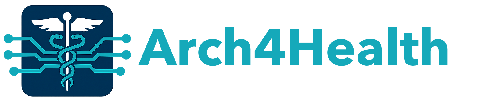

<!-- index.md -->

  <a href="#description">Description</a>
  <a href="#call-for-presentations">Call for Presentations</a>
  <a href="#key-dates">Key Dates</a>
  <a href="#organizers">Organizers</a>
  <a href="#agenda-materials">Agenda & Materials</a>

{: width="700px" }

<h3 style="color: #7F7FFF;font-style: italic;">
  A full-day workshop exploring the key computational challenges in health-related applications   
  and the vital role of computer architecture in overcoming them to advance healthcare
</h3>

**6th July 2026 (Monday), Belfast, Northern Ireland, United Kingdom**  
**In conjunction with [ACM International Conference on Supercomputing 2026 (ICS 2026)](https://dipsa-qub.github.io/ICS2026-webpage/)**

## Workshop Description {#description}

**Opportunities.** Recent biotechnological advances enable high-throughput, low-cost, and accurate biological data generation (e.g., using genome sequencing, multimodal medical imaging, continuous wearable sensing). This wealth of data enables unique opportunities for advancing healthcare. These opportunities include, but are not limited to, precision medicine, bedside personalized care, discovering early warning signs of communicable diseases, continuous physiological tracking, and enhanced diagnostic capabilities.

**Challenges.** Despite these opportunities, efficiently analyzing large-scale biological data poses significant challenges for conventional computing systems. These systems often cannot keep up with the high-throughput rate at which data is generated, and they face additional constraints related to energy efficiency, scalability, privacy, and security. High-throughput processing is particularly crucial in clinical settings, where real-time data processing can significantly impact patient outcomes by improving both response times in time-critical scenarios as well as the decision-making processes for therapeutic schemes. Therefore, to facilitate the wide adoption of recent advances in healthcare, there is a need to optimize the computing systems to enable high-performance, energy-efficient, low-cost, private, and secure analysis of biological data.

**Architecture for Health.** This workshop will focus on identifying key computational challenges in health-related applications and discussing how computer architects can contribute to advancing healthcare by addressing these challenges. First, we will provide invited talks and keynotes that summarize (i) a series of research in computing system designs for healthcare applications and (ii) new trends and bottlenecks in data-intensive healthcare applications. Second, we will invite researchers to submit their ongoing work on these topics.

**Fostering Diverse and Cross-Disciplinary Discussions.** Since cross-disciplinary discussions are crucial for better identifying challenges in real-world health-related applications, we aim to foster open discussions and cooperation between researchers with diverse backgrounds (i.e., from both computer architecture and health sciences communities, industry, and academia).

Join us live here: 

  <iframe
    src="https://www.youtube.com/embed/0ewCWTPIv4I"
    title="Arch4Health @ ICS 2026 — Livestream"
    style="width: 100%; height: 100%; border: 0; border-radius: 6px;"
    allow="accelerometer; autoplay; clipboard-write; encrypted-media; gyroscope; picture-in-picture; web-share"
    allowfullscreen>
  </iframe>

## Call for Presentations {#call-for-presentations}

This workshop consists of talks on the general topic of computing system designs for healthcare applications and new trends and bottlenecks in data-intensive healthcare applications. There are a limited number of slots for talks. If you are interested in delivering a talk on related topics, **please submit your talk's title and extended abstract via <a href="https://forms.gle/WCoT3T9b9C1cheAC7">this Google Form</a>**. You may either submit an **extended abstract** or upload a **short paper** (maximum 4 pages) prepared in any standard conference template. Each submission must include the talk title, all authors' names, and their affiliations. Accepted short papers will be included in the ACM Proceedings.

We invite abstract submissions related to (but not limited to) the following topics:

- Computational Biology
  - Genomics
  - Metagenomics
  - Gene editing
  - Drug Design and Discovery
  - Proteomics
  - Other Areas in Precision Medicine
- Neuroscience
  - Brain-Machine Interfaces
  - Prosthetics
- Wearable Systems for Health
- Medical robotics
  - Surgery
  - Haptics
- Mental Health
- Medical Imaging
  - Brain scans
  - Radiology
  - Single-Cell Analysis
- Agent-Based Simulations
- Medical Privacy
- Bio-Sensors

## Key Dates {#key-dates}

- **Extended Abstract and Short Paper Submission Deadline:** 24 April 2026
- **Notification:** 30 April 2026
- **Workshop Date:** 6th July 2026

## Organizers {#organizers}

  

    

      
      
<a href="https://sites.google.com/view/nikamansourighiasi/" style="color: inherit; text-decoration: none;">Nika Mansouri Ghiasi</a>

    

    

      
Email: <a href="mailto:nika.mansourighiasi@safari.ethz.ch">nika.mansourighiasi@safari.ethz.ch</a>

      
Nika Mansouri Ghiasi is a PhD student in the SAFARI Research Group at ETH Zurich, advised by Professor Onur Mutlu. Her research interests are in computer architecture and computational biology, focusing on 1) storage systems, large-scale bioinformatics applications, and their interactions, and 2) emerging technologies such as ultra-dense 3D integrated systems. She is interested in designing high-performance, energy-efficient, and low-cost systems that facilitate the widespread adoption of data-intensive applications needed in healthcare and precision medicine. For more information, please see her website: <a href="https://bit.ly/nikamgh">bit.ly/nikamgh</a>.

    

  

  

    

      
      
<a href="https://ihpcs.ethz.ch/people/person-detail.MzQ0MTU2.TGlzdC8zOTQxLDc2NTU1MzE0Mg==.html" style="color: inherit; text-decoration: none;">Dr. Konstantina Koliogeorgi</a>

    

    

      
Email: <a href="mailto:kkoliogeorgi@ethz.ch">kkoliogeorgi@ethz.ch</a>

      
Konstantina Koliogeorgi is a Postdoctoral Researcher at the SAFARI Research Group at ETH Zurich, led by Prof. Onur Mutlu. She received her Ph.D. degree in Electrical and Computer Engineering in 2023 at National Technical University of Athens (NTUA), advised by Prof. Dimitrios Soudris. Her research interests are in the field of computer systems and architecture, heterogeneous computing, and hardware acceleration. Her research has focused on hardware-software co-design, efficient high-level synthesis optimization, and design space exploration, targeting mainly genome analysis applications.

    

  

  

    

      
      
<a href="https://people.inf.ethz.ch/omutlu/" style="color: inherit; text-decoration: none;">Professor Onur Mutlu</a>

    

    

      
Email: <a href="mailto:omutlu@gmail.com">omutlu@gmail.com</a>

      
Onur Mutlu is a Professor of Computer Science at ETH Zurich. He previously held the William D. and Nancy W. Strecker Early Career Professorship at Carnegie Mellon University. His research interests are in computer architecture, computing systems, hardware security, memory & storage systems, and bioinformatics, with a major focus on designing fundamentally energy-efficient, high-performance, and robust computing systems. He started the Computer Architecture Group at Microsoft Research (2006-2009), and held product, research, and visiting positions at Intel Corporation, Advanced Micro Devices, VMware, Google, and Stanford University. He received various honors for his research, including the 2025 IEEE Computer Society Harry H. Goode Memorial Award “for seminal contributions to computer architecture research and practice, especially in memory systems.” He is an ACM Fellow, IEEE Fellow, and an elected member of the Academy of Europe. He enjoys teaching, mentoring, and enabling & democratizing access to high-quality research and education. He has supervised 24 PhD graduates, many of whom received major dissertation awards, 15 postdoctoral trainees, and more than 60 Master’s and Bachelor’s students. His computer architecture and digital logic design course lectures and materials are freely available on YouTube, and his research group makes a wide variety of artifacts freely available online. For more information, please see his webpage at <a href="https://people.inf.ethz.ch/omutlu/">https://people.inf.ethz.ch/omutlu/</a>.

    

  

## Agenda & Workshop Materials {#agenda-materials}

<table class="agenda-table">
  <colgroup>
    <col>
    <col>
    <col>
  </colgroup>
  <thead>
    <tr>
      <th>Time</th>
      <th>Speaker</th>
      <th>Title</th>
    </tr>
  </thead>
<tbody>
  <tr>
    <td>9:00 - 9:15</td>
    <td>
      Nika Mansouri Ghiasi 
      Konstantina Koliogeorgi 
      Onur Mutlu 
      (ETH Zurich)
    </td>
    <td>
      Welcome Notes  
      Architecture for Health: Exploring Computational Challenges in Health-Related Applications and How Computer Architecture Can Address Them
    </td>
  </tr>

  <tr>
    <td>9:15 - 10:00</td>
    <td>Hasindu Gamaarachchi 
      (School of Computer Science and Engineering, UNSW Sydney)</td>
    <td>Scalable, Portable and Live Nanopore Sequence Analysis</td>
  </tr>

  <tr>
    <td>10:00 - 10:30</td>
    <td>Max Doblas 
      (Barcelona Supercomputing Center)</td>
    <td>From Algorithm to Silicon Hardware-Software Co-Design of a RISC-V Edit Distance Accelerator for Sequence Alignment</td>
  </tr>

  <tr class="break-row">
    <td colspan="3">10:30 - 11:00 &nbsp;&nbsp;&mdash;&nbsp;&nbsp; Coffee Break</td>
  </tr>

  <tr>
    <td>11:00 - 11:45</td>
    <td>Krishna Kant 
      (Temple University)</td>
    <td>Chronic Disease Management Networks</td>
  </tr>

  <tr>
    <td>11:45 - 12:30</td>
    <td>Onur Mutlu 
      (ETH Zurich)</td>
    <td>Accelerating Genome Analysis</td>
  </tr>

  <tr class="break-row">
    <td colspan="3">12:30 - 13:30 &nbsp;&nbsp;&mdash;&nbsp;&nbsp; Lunch Break</td>
  </tr>

  <tr>
    <td>13:30 - 14:15</td>
    <td>Bertil Schmidt 
      (JGU Mainz)</td>
    <td>Addressing Key Challenges in Accelerated Computing for Omics Pipelines</td>
  </tr>

  <tr>
    <td>14:15 - 14:40</td>
    <td>Zeynep Akcil, Can Alkan 
      (Bilkent University)</td>
    <td>POACHA: Partial Order Alignment Computation Hardware Acceleration</td>
  </tr>

  <tr>
    <td>14:40 - 15:00</td>
    <td>Eirini Tzermpou 
      (ETH Zurich)</td>
    <td>A High-Performance and Low-Cost Algorithm-Architecture Co-Design for Graph-based Genome Analysis</td>
  </tr>

  <tr class="break-row">
    <td colspan="3">15:00 - 15:30 &nbsp;&nbsp;&mdash;&nbsp;&nbsp; Coffee Break</td>
  </tr>

  <tr>
    <td>15:30 - 15:50</td>
    <td>Eric Santigosa-Lepe 
      (Barcelona Supercomputing Center)</td>
    <td>Sequence Alignment Acceleration on the Edge Using an FPGA MPSoC</td>
  </tr>

  <tr>
    <td>15:50 - 16:10</td>
    <td>Berkan Şahin 
      (Bilkent University)</td>
    <td>In-depth data movement characterization of DNA read mapping algorithms</td>
  </tr>

  <tr>
    <td>16:10 - 16:25</td>
    <td>Raghu Shankar 
    (Tech Entrepreneur)</td>
    <td>Genomics: Scale-up and Scale-out with System in a Package as-a-Platform</td>
  </tr>

  <tr>
    <td>16:25 - 16:40</td>
    <td>Nika Mansouri Ghiasi 
      (ETH Zurich)</td>
    <td>Storage-Centric System Designs for Enabling Fast, Efficient, and Low-Cost Genomic and Metagenomic Analyses</td>
  </tr>

  <tr>
    <td>16:40 - 16:55</td>
    <td>Konstantina Koliogeorgi 
      (ETH Zurich)</td>
    <td>MARS: Processing-In-Memory Acceleration of Raw Signal Genome Analysis Inside the Storage Subsystem</td>
  </tr>

  <tr>
    <td>16:55 - 17:00</td>
    <td>
      Nika Mansouri Ghiasi 
      Konstantina Koliogeorgi 
      Onur Mutlu 
      (ETH Zurich)
    </td>
    <td>Closing Remarks</td>
  </tr>
</tbody>
</table>

## Previous Iteration {#previous-iteration}

You can find information regarding the previous iterations of the workshop (held in conjunction with MICRO 2025 in Seoul and HPCA 2026 in Sydney) 
<strong><a href="https://events.safari.ethz.ch/micro25-arch4health/" target="_blank">here</a></strong> and <strong><a href="https://events.safari.ethz.ch/hpca26-arch4health/" target="_blank">here</a></strong>.

 

